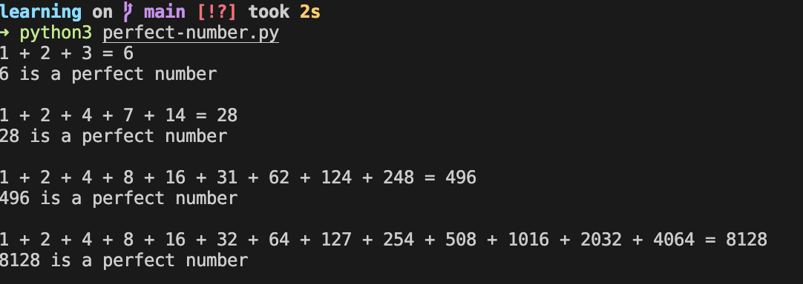

# Ejercicio_NumerosPerfectos

En este repositorio encuentras la descripción del ejercicio que te invita a resolver un problema el cual consiste en encontrar a los primeros números perfectos menores a n.
## Descripción

Se busca que crees un algoritmo el cuál calcule, dado un número n, los números perfectos que son menores a n.

La primera pregunta que te debe de surgir es:

### ¿Qué es un numero perfecto?

Es un número perfecto es aquel el cuál la suma de sus divisores te da el mismo, claro sin contar como divisor a este mismo.

Para ponerte un ejemplo, el número 6 es un número perfecto, esto debido a que 6 es divisible entre 1, 2 y 3, entonces:

```math
1 + 2 + 3 = 6
```

Por lo tanto 6 es perfecto.

Ahora tú crea el código que cumpla con estas condiciones en el lenguaje que te sientas más cómodo. Para que tengas como referencia los primeros números perfectos son:

```math
6, 28, 496 y 8128.
```

## Resultado




