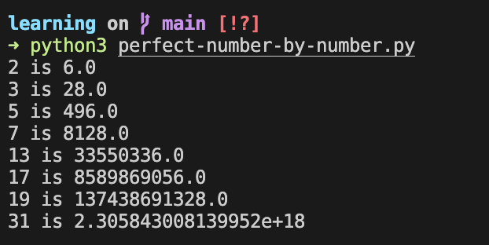

# Ejercicio_NumerosPerfectos

En este repositorio encuentras la descripción del ejercicio que te invita a resolver un problema el cual consiste en encontrar a los primeros números perfectos menores a n.
## Descripción

Se busca que crees un algoritmo el cuál calcule, dado un número n, los números perfectos que son menores a n.

La primera pregunta que te debe de surgir es:

### ¿Qué es un numero perfecto?

Es un número perfecto es aquel el cuál la suma de sus divisores te da el mismo, claro sin contar como divisor a este mismo.

Para ponerte un ejemplo, el número 6 es un número perfecto, esto debido a que 6 es divisible entre 1, 2 y 3, entonces:

```math
1 + 2 + 3 = 6
```

Por lo tanto 6 es perfecto.

Ahora tú crea el código que cumpla con estas condiciones en el lenguaje que te sientas más cómodo. Para que tengas como referencia los primeros números perfectos son:

```math
6, 28, 496, 8128 ...
```

## Resultado

Para entender el comportamiento existen dos procesos diferentes:

1. Verificar si un número dado es un número perfecto
2. A partir de un número dado generar su número perfecto

### Verificar si un número dado es un número perfecto

Como primera parte, tenemos que entender qué y cómo se genera un numero perfecto, con un simple ejemplo entenderemos:

```math
# Número perfecto a verificar
n = 28
```

Uno pensaria que realizando la siguiente sucesion esta correcta, PERO encontramos numeros con decimales

```math
28 / 2 = 14
14 / 2 = 7
7  / 2 = 3.5 <-
4  / 2 = 2
2  / 2 = 1
```

En este caso podriamos redondear al mayor numero para que sea igual a 4; pero estariamos haciendo trampa en la ejecucion del problema y aun mas, podriamos **no** tener una solucion correcta.


Para ello, debemos tener en cuenta dos cosas mas.

1. Entender realmente que es un numero perfecto:

    > Un número perfecto es un número natural tal que **la suma de sus divisores es igual que el número**. Obviamente no puede incluirse entre los divisores al propio número.

    Entendiendo la frase:
    > ... la suma de sus divisores es igual que el número

    Simplemente tenemos que encontrar los divisores de dicho numero, pero surge una duda que es un divisor de un numero; la respuesta en cortas palabras son **números que dividen exactamente a otros números**. 

    Por ejemplo, los divisores del número 4 son 1, 2 y 4. 

    ```math
    n = 4

    ...

    divisores = [1, 2, 4]

    # Demostracion
    4 / 1 = 4
    4 / 2 = 2
    4 / 4 = 1

    # NO dejan residuo alguno (decimales sobrantes)

    ```

    Estos últimos números dividen de forma exacta a cuatro, en donde el resultado de la división es un número entero y el residuo es cero.

    Pero entonces de nuestro segunda duda es, como en programacion saco los decimales; Teniendo en cuenta que:

    números que dividen **exactamente** a otros números sin dejar residuo podemos interpretarlo como:

    ```python
    # Numero
    > number = 4
    # Verificar si al hacer MOD del numero 4 entre 2 no nos da ningun residuo (en este caso 0)
    > number % 2 == 0 
    # Verdadera la condicion
    > True
    ```

    A partir de esta condicion, entendemos que podemos sacar aquellos numeros que no contengan residuo a partir de cualquier numero, simplemente debemos filtrarlo:


    ```python
    # Numero
    number = 4
    # Filtro
    list = []
    # Sacamos los numeros del 1 al 4 [1, 2, 3, 4]
    for i in range(1, number):
        # Verificamos si no nos da algun residuo
        if number % i == 0:
            list.append(i)
    # Imprimir resultados
    print(list)
    # [1, 2]
    ```

    Entoces a este proceso se le llama obtencion de los numeros primos de un numero; ya que son aquellos numeros que componen a otro (en donde se entiende que estos numeros dados no tienen/generan residuo alguno)

2. A partir de un número dado generar su número perfecto

    Y Ya sabiendo ello de la segunda pregunta principal, podemos ejecutar el proceso para aquellos numeros perfectos:


    ```python
    # Numero
    numero = 28
    # Filtro
    list = []
    # Sacamos los numeros del 1 al 4 [1, 2, 3, 4]
    for i in range(1, number):
        # Verificamos si no nos da algun residuo
        if number % i == 0:
            list.append(i)
    # Imprimir resultados
    print(list)
    # [1, 2, 4, 7, 14]

    ```

    Y notando estos valores, son entonces:

    ```math
    1 + 2 + 4 + 7 + 14 
    3 + 4 + 7 + 14
    7 + 7 + 14
    14 + 14
    28
    ```

    Donde:

    ```math
    Numero dado == Suma(Primos(Numero dado))
    28 = 28
    ```

    Y a partir de ello **encontramos el numero perfecto**, a apartir de la suma de los numeros primos que contiene el numero dado.

    Y Si lo probamos de manera autonoma, encontramos lo siguiente:

    


### A partir de un número dado generar su número perfecto

Ya habiendo entendido el concepto de numero perfecto ahora es mas sencillo aplicar la ecucacion principal para que a partir de un numero saquemos su numero perfecto.

```math
2^(n-1) * (2^n - 1) = N
```

Donde tenemos lo siguiente

```math
n = Numero dado
N = Numero perfecto encontrado
```

Teniendo la concepcion anterior de: Un numero perfecto se da gracias a la suma de sus numeros pares. Aqui debemos validar si: 

```math
n = Numero par
(2^n - 1) = Numero par
```

Teniendo en cuenta ello si podemos generar el proceso necesario, un calculo sencillo:

```python
# Numero Dado
number = 2
# Verificar si es primo (n)
if is_prime(number):
    # Realizar el calculo para verificar si tmabien es primo
    # math.pow(2, number) = 2^n
    complement = (math.pow(2, number) - 1)
    # Verificar si es primo (2^n - 1)
    if is_prime(complement):
        # De ser validos, entonces, realizamos el ultimo calculo
        calc = math.pow(2, (number - 1))
        result = calc * complement
        # Imprimimos resultados
        print("{} is {}".format(number, result))
        # 6
```

Y Asi tenemos el siguiente proceso si lo automatizamos:



---

Para Ver una lista de todos los numeros perfectos puedes ver

[Lista de todos los numeros perfectos](./doc/numero_perfecto.pdf)
